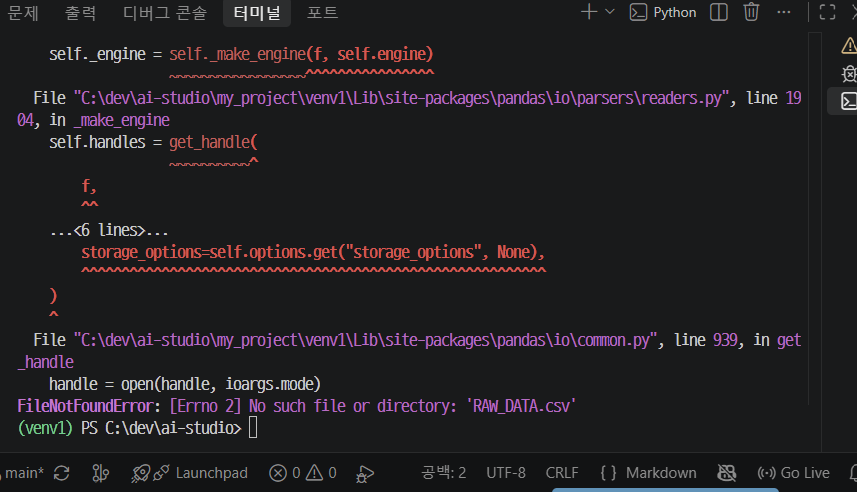
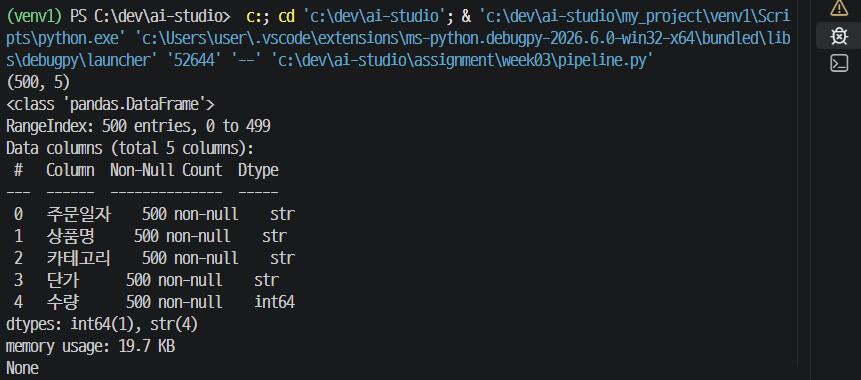

# shape, info() 확인 결과
(500, 5)     
<class 'pandas.DataFrame'>    
RangeIndex: 500 entries, 0 to 499    
Data columns (total 5 columns):    
| # | Column | Non-Null Count | Dtype |
|-|-|-|-|
| 0 |  주문일자  |  500 non-null  |  str  |
| 1 |  상품명  |   500 non-null  |  str  |
| 2 |  카테고리  |  500 non-null  |  str  |
| 3 |  단가   |   500 non-null  |  str  |
| 4 |  수량   |   500 non-null  |  int64  |
dtypes: int64(1), str(4)
memory usage: 19.7 KB
None

# 에러 메시지 해석

## 프롬프트: 오류 이유 알려줘 + 캡처본

## 채택 내역: 경로 지정이 잘못되서 발생한 오류
```
from pathlib import Path
import pandas as pd

# 현재 실행 중인 .py 파일이 들어 있는 폴더
BASE_DIR = Path(__file__).resolve().parent

# 그 폴더 안의 RAW_DATA.csv 파일 경로
csv_path = BASE_DIR / "RAW_DATA.csv"

df = pd.read_csv(csv_path, encoding="EUC-KR")
```
## 검증 내역:
